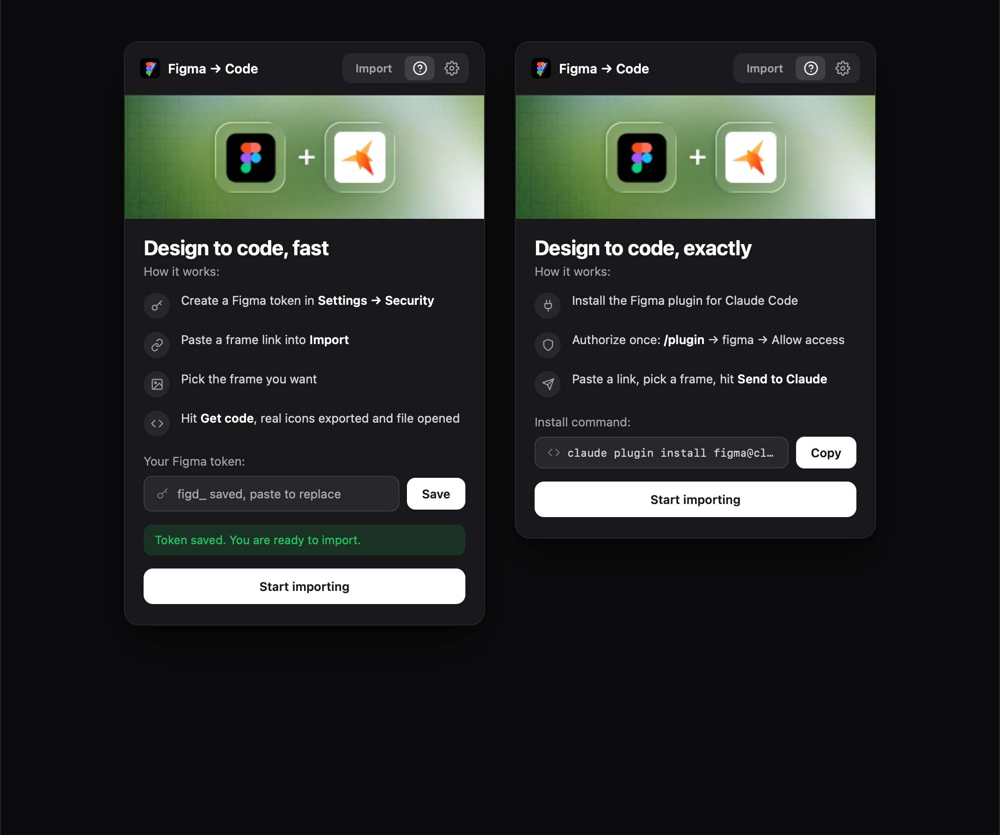
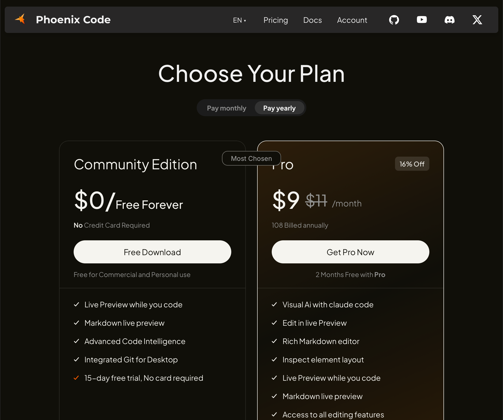

# FigmaToCode

Paste a Figma link, preview the frame, and pull it into your project as code, all inside [Phoenix Code](https://phcode.dev). No window-swapping, no export dance. A small panel lives next to your editor so the design and the code are always side by side.

> A designer-friendly bridge from Figma to code, right where you already work.

<p align="center">
  
</p>

Paste a link, pick a frame, and get the design in your project as code, with every icon exported straight from the source:

<p align="center">
  
</p>

---

## Two ways to generate, pick your plan

FigmaToCode adapts to your Figma seat. On first run it asks which you have, and you can switch anytime from the toggle in **Import** or from **Settings**.

### Free seat
Uses a **Figma personal access token** and Figma's REST API.
- Renders every frame in a link as a live thumbnail.
- **Get code** writes a self-contained `.html` file into your project and opens it.
- **Real icons and images are exported** from the design (no blank boxes) and the frame's fonts are loaded.
- Great for getting the layout down fast. It is an approximate converter (absolute positioning), so treat it as an 80% starting point.

### Paid / Dev-Mode seat
Uses **Claude** plus Figma's design-to-code engine for pixel-faithful output.
- **Send to Claude** drops a ready prompt (with the exact frame URL) into the Phoenix AI panel and submits it.
- Claude pulls full design context, exports all assets, and writes accurate, responsive, semantic code into your project.
- This is the highest-fidelity path.

---

## Features

- **Paste a link, see it instantly** - frames render as thumbnails right in the panel.
- **Pick the frame you want** - click a thumbnail to select it.
- **One click to code** - **Get code** (free) or **Send to Claude** (paid).
- **Icon and image export** on the free path so nothing renders as an empty box.
- **Built-in tutorial** - a short, plan-aware walkthrough. Replay it anytime from the `?` tab.
- **Your token stays local** - the Figma personal access token is stored only in Phoenix's preferences on your machine. Never uploaded anywhere.
- **Adjustable preview resolution** - 1x to 4x in Settings.

---

## Install

### Manual install (current)
1. Download or clone this repo.
2. In Phoenix Code: **Debug → Load Project As Extension** and pick the folder.
3. The FigmaToCode icon appears in the right-side toolbar. Click it to open the panel.

### From the Extension Manager (once published)
1. **File → Extension Manager**
2. **Available** tab, search **"FigmaToCode"**
3. **Install**

---

## Getting a Figma token (free seat)

Figma → **Settings → Security → Personal access tokens → Generate new token**. Read-only scope is enough. Paste it into the tutorial's token step, or the **Settings** tab. If no token is set, the Settings icon shows a red dot as a reminder.

## Setting up the paid path (Dev-Mode seat)

1. Install the Figma plugin for Claude Code:
   ```
   claude plugin install figma@claude-plugins-official
   ```
2. Restart Claude Code, run `/plugin`, open the **Installed** tab, select **figma**, and authorize.
3. In FigmaToCode: paste a link, pick a frame, and hit **Send to Claude**.

---

## Usage

| Action | How |
|---|---|
| **Pick your plan** | The Free / Paid toggle at the top of **Import** (or the tutorial) |
| **Add your token** (free) | Tutorial token step, or the `⚙` Settings tab |
| **Load a design** | Paste a Figma link into the composer and hit the arrow (or Enter) |
| **Pick a frame** | Click a thumbnail to select it |
| **Get the code** (free) | **Get code** writes and opens an `.html` file |
| **Generate accurately** (paid) | **Send to Claude** hands the frame to the AI panel |
| **See it render** | Turn on Phoenix **Live Preview** on the generated file |
| **Replay the tutorial** | `?` tab |
| **Change preview quality** | `⚙` → Preview resolution |

---

## How it works

- **Preview** uses Figma's REST `GET /v1/images` endpoint to render each frame to a PNG.
- **Free code path** fetches the frame's node tree via `GET /v1/files/:key/nodes`, walks it depth-first, exports icon and image nodes as PNGs, and emits positioned HTML with inline styles derived from each node's geometry, fills, text style, radius, strokes, and effects.
- **Paid code path** composes a prompt for the selected frame and submits it to the Phoenix AI panel, which runs Figma's design-to-code flow and writes the result into the project.
- **Storage** is Phoenix's `PreferencesManager` (token, plan, and settings only). No external servers, no accounts.

---

## Roadmap

Possible additions, not promises:

- Auto-layout to flexbox instead of absolute positioning on the free path
- Component and variant awareness
- Export as React / JSX
- Batch import of multiple frames

Open an issue if any of these would matter to your workflow.

---

## Development

```bash
git clone https://github.com/Electrofist/FigmaToCode
```

Open the folder in [create.phcode.dev](https://create.phcode.dev), then:

1. **Debug → Load Project As Extension**
2. Make changes, save
3. **Debug → Reload With Extensions**

Escape hatch if something breaks Phoenix: **Debug → Reload Without Extensions**.

---

## License

MIT. Do whatever you want, just don't blame me.

---

## Author

Built by **Krrish** ([@Electrofist](https://github.com/Electrofist)).
